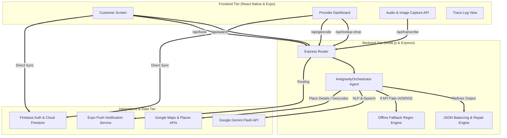
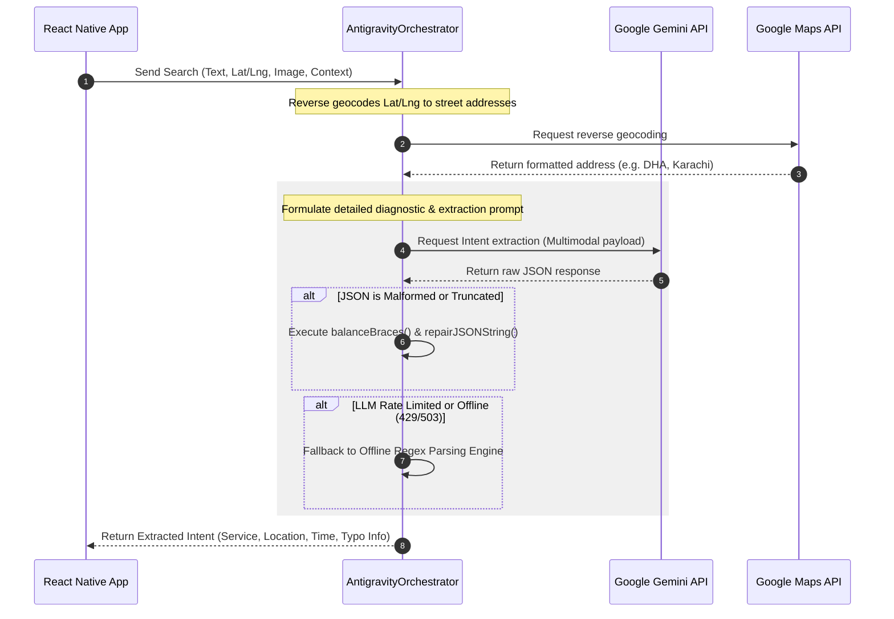
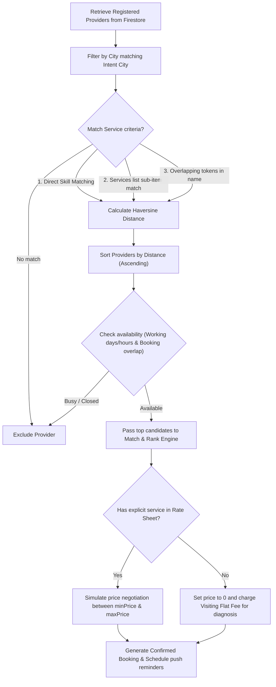

# Yaqeen | AI-Powered Service Marketplace Orchestrator

Yaqeen is a state-of-the-art, AI-powered service marketplace orchestrator designed for Pakistan's local service ecosystems (e.g., AC Repair, Plumbing, Electrical, Beauty Parlours, Junk Collector). 

The platform leverages advanced natural language processing (NLP), multimodal input parsing, and location-aware proximity matching to connect clients with registered local service providers. It abstracts away manual search and traditional directory lookups through a single voice/text search input or diagnostic image upload.

---

## Key Features

1. **Bilingual Natural Language Search**: Understands unstructured search queries typed or spoken in English, Urdu, and Roman Urdu (e.g., *"AC chal nahi raha aur cooling bilkul band hai"*).
2. **Diagnostic Multimodal Search**: Customers can upload images (e.g., a leaking pipe or AC compressor). The AI acts as a diagnostician, determining the exact service needed and routing it instantly.
3. **AI-Powered Shop Onboarding**: Providers can onboard in seconds using:
   - **AI Search**: Typing their shop name, which automatically pulls coordinates, address, and phone numbers from Google Places API.
   - **AI Link**: Pasting their Google Maps link, which automatically bypasses SSL inspection issues, resolves redirection links, parses raw URLs, and fetches structured details.
4. **Enforced Profile Completeness**: Locks provider accounts from accepting jobs or messaging clients until profile parameters (services, shop name, address, phone number, visiting charges) are fully configured.
5. **Interactive Agent Trace Logs**: Gives customers real-time visibility into the AI's reasoning steps, intent parameters, geocoding lookups, and auto-negotiation logs.
6. **Autonomic Fail-Safe Systems**: Employs strict offline regex, distance clustering fallbacks, and LLM JSON-repair modules to continue operating when APIs are rate-limited or offline.

---

## Detailed System Architecture

Yaqeen is designed as a distributed, decoupled three-tier system comprising a React Native/Expo frontend, an Express-based Node.js backend middleware containing the `AntigravityOrchestrator` AI agent, and Firebase services.

### Architecture Overview



### Detailed Architecture Tier Descriptions

1. **Frontend (React Native & Expo)**:
   - **Cross-Platform Delivery**: Built with React Native to deliver premium, responsive applications on Android and iOS.
   - **Dynamic Role Dashboards**: Customer and Provider views change state contextually based on Firebase authentication status.
   - **Native Hardware Integrations**: Interfaces with device cameras and photo libraries for diagnostic uploads and utilizes microphone recording APIs to stream speech-to-text binaries.
   - **Profile Completeness Engine**: Client-side blockades apply opacity overlays (`0.6`) and display warnings pointing out missing business configurations, locking out all active dashboard operations until fixed.
   - **Custom Skill Dropdown**: Searchable skill fields allow dynamic inputs. If an typed query doesn't match standard skills, a fallback button appears allowing providers to submit their exact search string as a custom skill under "Other".

2. **Backend (Node.js/Express Middleware)**:
   - **AntigravityOrchestrator**: Acts as the central nervous system. It orchestrates user intent parsing, geocoding coordinates, registered vendor filtering, and distance calculations.
   - **JSON Repair Logic**: Intercepts LLM outputs to automatically balance parentheses/braces, repair raw string blocks, and strip out conversational text or markdown code enclosures.
   - **Pakistani City Clustering**: If geocoding calls fail, the backend computes Haversine distances to nearest major Pakistani cities to cluster operational boundaries offline.
   - **Bypassing Redirections**: Resolves dynamic short URLs (such as `maps.app.goo.gl`) to full Google Maps links, parsing place queries directly from the redirected URL components.

3. **Data & Infrastructure (Firebase / Cloud)**:
   - **Cloud Firestore**: Holds NoSQL records of user states, service offerings, negotiation parameters, active bookings, and dynamic push tokens.
   - **Firebase Authentication**: Handles secure authentication sessions using standard email credentials and native Google sign-in.
   - **Expo Notification Services**: Pushes real-time alerts to devices during matching, booking status changes, and customer-provider chats.

---

## Core Agent Pipelines & Logic

### 1. Intent Extraction Pipeline

When a search is triggered, the agent processes the user text (and potential diagnostic image):



### 2. Proximity Matching & Autonomic Negotiation Pipeline

After extracting the intent, the orchestrator retrieves and matches local service providers:



---

## Fail-Safe Offline & Robustness Features

### 1. Robust JSON Parsing & Structural Repair
LLM responses can sometimes get truncated due to token limits or contain markdown backticks. The `AntigravityOrchestrator` implements an automated recovery loop:
- **Brace Balancing (`balanceBraces`)**: Automatically tracks unclosed brackets `[` and braces `{` in truncated strings, closing them in the correct sequence to yield syntactically valid JSON.
- **Repair Engine (`repairJSONString`)**: Repairs common JSON typos made by generative models: normalizes mismatched quotation marks, strips out carriage returns, adds missing quotes to object keys, and prunes trailing commas.

### 2. Bilingual Offline Fallback Parser
If the Google Gemini API is inaccessible, rate-limited, or fails to generate a response, the system triggers the deterministic offline parser:
- **Regex Service Categorizer**: Maps key terms across 24 core service categories (such as `ac`, `gas refill`, `cool` -> **AC Repair**; `plumb`, `tap`, `toti`, `leakage` -> **Plumbing**).
- **Localized Date/Time Parser**: Interprets English, Urdu, and Roman Urdu relative date terms (e.g. `today`, `aaj`, `tomorrow`, `kal`, `parson`, `shaam`, `raat`, `baje`) and maps them to absolute ISO timestamps.

### 3. Geographical Offline Fallback
When the Google Maps Geocoding API fails or keys are inactive, the backend falls back to local distance mapping. It calculates the closest metropolitan center using coordinate clustering for major cities:
- *Islamabad, Rawalpindi, Lahore, Karachi, Peshawar, Faisalabad, Multan, Quetta, Sialkot, Gujranwala, Hyderabad*.
- Auto-extracts the nearest city and sets standard area defaults (e.g., G-13 for Islamabad, Clifton for Karachi).

---

## Database Schema (Firebase Firestore)

### 1. `users` Collection
Stores metadata, role classification, and business setup status for customers and providers.
```json
{
  "uid": "USER_ID_STRING",
  "email": "provider@gmail.com",
  "name": "Ali AC Services",
  "role": "provider",
  "city": "Islamabad",
  "area": "G-13",
  "primarySkill": "AC Repair",
  "customSkill": "Inverter Specialist", 
  "shopName": "Ali Air Conditioning & Cooling Shop",
  "shopAddress": "Shop #3, G-13 Markaz, Islamabad, Pakistan",
  "landmark": "Near Allied Bank",
  "phoneNumber": "03001234567",
  "visitingCharges": 500,
  "minPrice": 1000,
  "maxPrice": 8000,
  "rating": 4.9,
  "userRatingsTotal": 45,
  "latitude": 33.6493,
  "longitude": 72.9806,
  "services": {
    "Split AC Service": { "minPrice": "1500", "maxPrice": "2500" },
    "Gas Refill (R410)": { "minPrice": "4000", "maxPrice": "7000" }
  },
  "availability": {
    "workingDays": ["Mon", "Tue", "Wed", "Thu", "Fri", "Sat"],
    "startTime": "09:00 AM",
    "endTime": "09:00 PM"
  },
  "pushToken": "ExponentPushToken[xxxxxxxxxxxxxxxxxxxxxx]"
}
```

### 2. `bookings` Collection
Maintains transaction states, estimated pricing, and scheduling parameters.
```json
{
  "bookingId": "BKG-987654",
  "customerId": "CUSTOMER_ID_STRING",
  "providerId": "PROVIDER_ID_STRING",
  "service": "AC Repair",
  "time": "Friday, May 22, 2026 at 5:00 PM",
  "clockTime": "5:00 PM",
  "estimatedPrice": 2500,
  "visitingCharges": 500,
  "status": "CONFIRMED", 
  "createdAt": "2026-05-21T01:10:00Z"
}
```

---

## Firestore Security & Access Control (`firestore.rules`)

To protect database integrity and guarantee that service providers fulfill the profile completeness requirements before engaging in transactions, Firestore rules are defined as follows:

- **Deadlock Prevention on Profiles**: Allows authenticated users to perform reads and writes on their own `/users/{userId}` documents directly. This ensures that a new or incomplete provider is always allowed to submit information and rate sheet services to complete their profile.
- **Completeness Guards on Bookings**: Appends `isProfileComplete()` checks on all `create`, `update`, and `delete` operations inside the `/bookings/{bookingId}` collection, as well as on chat messages within booking channels (`/bookings/{bookingId}/messages/{messageId}`).
- **Evaluated Fields for Providers**:
  - `shopName`, `shopAddress`, and `phoneNumber` must be defined and non-empty strings.
  - `city` and `area` must be valid strings.
  - `visitingCharges` must be a positive integer/float (> 0).
  - `services` rate sheet map must have at least one defined service mapping (`size() > 0`).

---

## Installation & Setup

### Environment Variables

#### Backend (`backend/.env`)
Create a file named `.env` in the backend root directory:
```env
PORT=4000
GEMINI_API_KEY=your_gemini_api_key
GOOGLE_MAPS_API_KEY=your_google_maps_api_key
MOCK_AI=false
```

#### Frontend (`mobile-app/.env` / Config)
Create a file named `.env` in the `mobile-app` root directory to configure the Firebase and Google Maps variables:
```env
EXPO_PUBLIC_FIREBASE_API_KEY=your_firebase_api_key
EXPO_PUBLIC_FIREBASE_AUTH_DOMAIN=your_firebase_auth_domain
EXPO_PUBLIC_FIREBASE_PROJECT_ID=your_firebase_project_id
EXPO_PUBLIC_FIREBASE_STORAGE_BUCKET=your_firebase_storage_bucket
EXPO_PUBLIC_FIREBASE_MESSAGING_SENDER_ID=your_firebase_messaging_sender_id
EXPO_PUBLIC_FIREBASE_APP_ID=your_firebase_app_id
EXPO_PUBLIC_GOOGLE_MAPS_API_KEY=your_google_maps_api_key
```

### Backend Setup
1. Navigate to the backend directory:
   ```bash
   cd backend
   ```
2. Install dependencies:
   ```bash
   npm install
   ```
3. Start the Express server in development mode:
   ```bash
   npm start
   ```

### Frontend Setup
1. Navigate to the mobile application directory:
   ```bash
   cd mobile-app
   ```
2. Install dependencies:
   ```bash
   npm install
   ```
3. Start the Expo developer client:
   ```bash
   npx expo start
   ```
